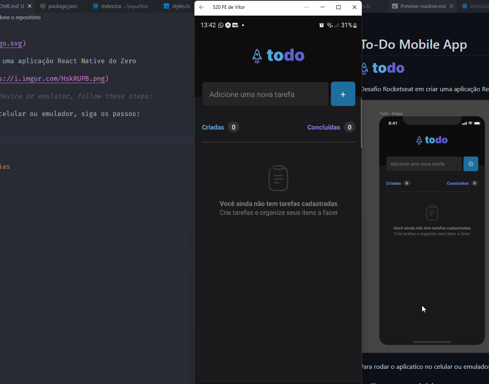

# To-Do Mobile App


Desafio Rocketseat em criar uma aplicação React Native do Zero


<!-- To run the app in the device or emulator, follow these steps:
Clone the repo. -->
Para rodar o aplicatico no celular ou emulador, siga os passos:

### 1- Clone o repositório


### 2- Instale as dependências
  
``` 
$ yarn
   or
$ npm install 
```

### 3- Rode a aplicação

``` 
$ yarn start
   or
$ npm start 
```

## Features

<ul>
    <li>React Native</li>
    <li>ExpoGo</li>
    <li>JDK</li>
    <li>TypeScript</li>
<ul>



